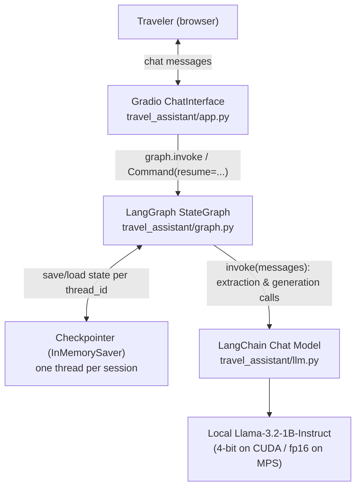
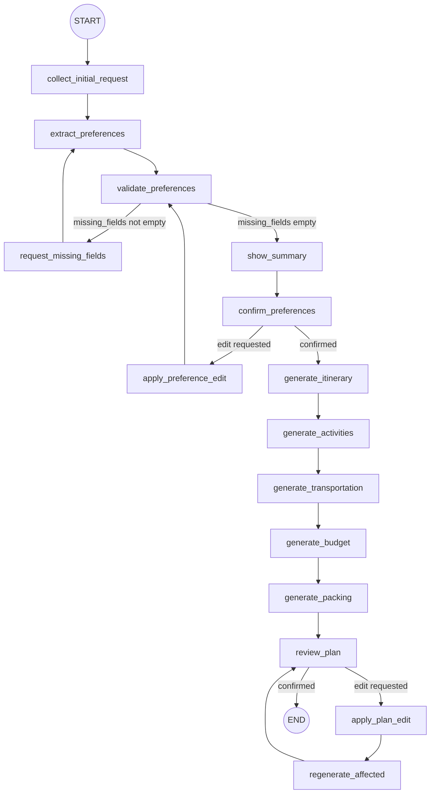
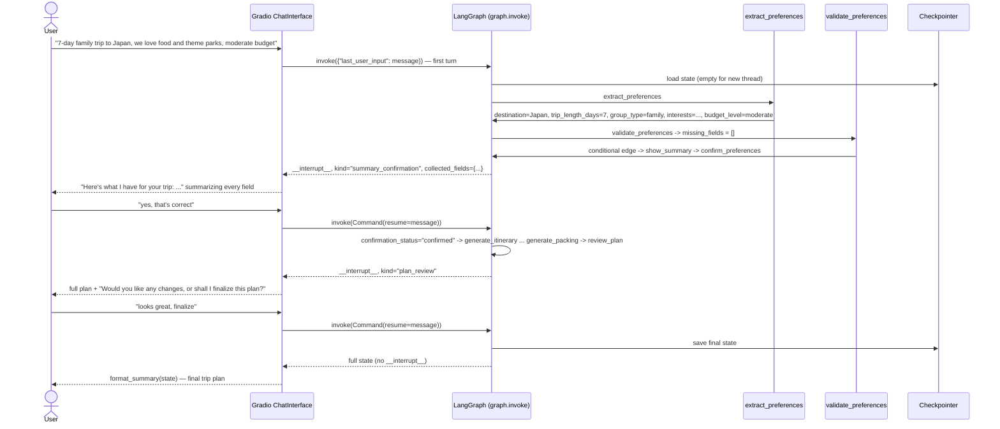
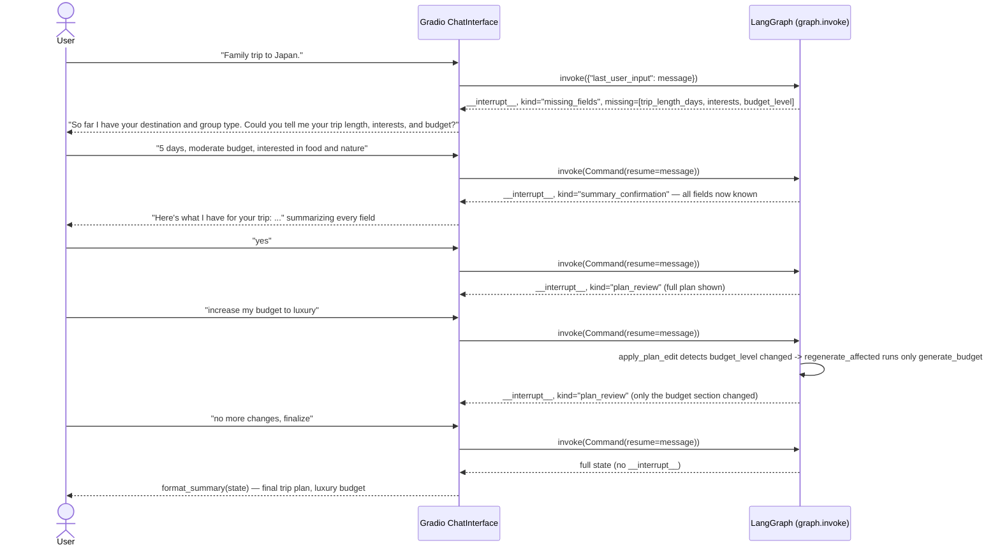

# Design Document: AI-Powered Travel Assistant Planner

Group 4 — MSAI-631-B01

## 1. Purpose

This document details the system architecture, conversational workflow, and
interaction design for the AI-Powered Travel Assistant Planner described in
the [Project Proposal](../Group%204_Project%20Proposal.pdf). It reflects the
system **as implemented** in `travel_assistant/`: an adaptive,
extraction-based conversation rather than a fixed sequential questionnaire.
The user describes their trip in free text; the graph extracts whatever
preference fields it can, asks only for what's missing (accepting several
fields in one reply), shows a confirmation summary the user can edit, then
generates an itinerary, activity recommendations, transportation
suggestions, a budget estimate, and a packing checklist — after which the
user can request further edits, which regenerate only the affected
section(s), before finalizing.

## 2. System Architecture



**Why LangGraph instead of calling `transformers` directly:** the chatbot
has a clear multi-stage scope (collect preferences → confirm → itinerary →
activities → transportation → budget → packing → review). LangGraph models
this as an explicit `StateGraph` where the *code* controls what happens
next via fixed and conditional edges, and the LLM is only ever asked to
extract structured fields from one message or generate text for one
section at a time. This is more reliable than an LLM-driven agent loop,
which matters because the project's chosen model (~1B parameters) is not
strong enough to plan multi-step tool use on its own — routing decisions
(is a field missing? did the user confirm or ask to edit?) are made by
plain Python reading state, never by asking the LLM what to do next.

**Session isolation:** each browser session gets a random `thread_id`
(`travel_assistant/app.py`). LangGraph's checkpointer keys all state by
`thread_id`, so multiple users can chat with the deployed demo at once
without seeing each other's trips.

## 3. Workflow Diagram (LangGraph state machine)

This is the actual graph compiled in `build_graph()`
(`travel_assistant/graph.py`) — fifteen nodes, connected by both fixed
edges and three conditional-edge decision points:



### 3.1 Preference collection: `collect_initial_request` → `extract_preferences` → `validate_preferences`

`collect_initial_request` normally does nothing but pass through — `app.py`
seeds `last_user_input` with the user's very first chat message before the
graph starts, so there's real content to extract from immediately. Its
`interrupt()` only fires as a fallback (e.g. an empty first message),
asking "Tell me about the trip you would like to plan" explicitly instead
of extracting from nothing.

`extract_preferences` makes one LLM call per pass: it sends
`last_user_input` to the model with a system prompt asking for a JSON
object of exactly eight fields (`destination`, `trip_length_days`,
`group_type`, `interests`, `budget_level`, `travel_style`,
`travel_season`, `must_visit_attractions`), then merges only the
non-null, not-yet-known fields into state — a field already set from an
earlier turn is never overwritten, so a later reply that only mentions
budget can't null out an already-known destination.

`validate_preferences` is pure Python — no LLM call. It recomputes
`missing_fields` (the subset of the five *required* fields still absent)
and `collected_fields` (a display-only string snapshot of every known
field, required or optional) from scratch on every pass, so these two
derived fields can never drift from the underlying typed state.

A conditional edge (`route_after_validation`) reads `missing_fields`:
non-empty routes to `request_missing_fields`; empty routes to
`show_summary`.

### 3.2 `request_missing_fields` (human-in-the-loop loop)

Interrupts with a payload naming every already-known field and every
still-missing required field, and waits for one reply. That reply can fill
in one field or all remaining fields at once — it becomes the next
`last_user_input`, and the edge back to `extract_preferences` means the
same extraction logic handles it, no special multi-field parsing needed.

**Graceful degradation:** each `extract_preferences` pass that finds zero
new required fields increments `extraction_attempts`; finding at least one
resets it to zero. Once `extraction_attempts` reaches 3, `request_missing_fields`
stops asking for everything still missing and instead asks for exactly one
field by name (`kind: "single_field_fallback"`) — protecting against an
unbounded loop if the small model repeatedly fails to extract cleanly from
free text.

### 3.3 `show_summary` → `confirm_preferences` (review before generation)

`show_summary` is a pass-through that only updates `conversation_stage`;
the actual pause happens in `confirm_preferences`, which interrupts with
the full `collected_fields` snapshot (`kind: "summary_confirmation"`) and
waits for the user to confirm or ask for a change.

`_is_confirmation()` checks the reply against a small set of literal
confirmation words/phrases (matched as whole words via regex, so e.g.
`"ok"` doesn't false-positive inside `"looking"`), plus a regex pattern
(`_CONFIRM_PATTERN`) for common affirmative sentence *shapes* — e.g. "all
look right," "everything sounds good," "that is fine" — so a phrasing not
literally in the word/phrase list still isn't misread as an edit request.
If it's a confirmation, `confirmation_status` is set to `"confirmed"` and
a conditional edge (`route_after_confirmation`) proceeds to
`generate_itinerary`. Otherwise, the reply is treated as an edit request
and routed to `apply_preference_edit`, which re-runs extraction with
`overwrite=True` (see §3.5) and loops back to `validate_preferences` — so
an edit during
confirmation re-validates the whole preference set, not just the one field
mentioned.

### 3.4 Generation nodes

Once preferences are confirmed, five nodes run automatically in sequence,
each making exactly one LLM call:

| Node | Reads | Produces |
|---|---|---|
| `generate_itinerary` | destination, trip length, group, interests, budget, optional context | day-by-day itinerary |
| `generate_activities` | destination, interests, group, optional context | 5–8 bulleted attraction/activity picks |
| `generate_transportation` | destination, trip length, group, budget | getting-around guidance |
| `generate_budget` | trip length, group, budget level | a **deterministic** rate-table dollar estimate, narrated by the LLM |
| `generate_packing` | destination, trip length, group, interests, optional context | bulleted packing checklist |

"Optional context" means any of `travel_style`, `travel_season`, or
`must_visit_attractions` the user happened to mention — these are folded
into the relevant prompts when present but are never required to proceed.

The budget estimate is intentionally hybrid: the dollar figure comes from
a fixed rate table (`_DAILY_RATE_BY_BUDGET` × `_GROUP_MULTIPLIER` × days)
in plain Python, and the LLM only writes a short narrative around that
number. This keeps the one field users are most likely to sanity-check (a
total dollar amount) independent of the small model's arithmetic ability.

Each generation node's core logic is factored into a plain `_*_update(llm,
state) -> dict` function (e.g. `_itinerary_update`), separate from the
`_make_*_node(llm)` closure that wraps it for the graph. This split exists
so `regenerate_affected` (§3.5) can call the same update logic directly on
demand, without re-running the whole five-node chain.

### 3.5 `review_plan` → edit/regenerate loop (post-generation)

After `generate_packing`, `review_plan` interrupts asking "Would you like
any changes, or shall I finalize this plan?" (`kind: "plan_review"`). A
confirming reply sets `confirmation_status: "confirmed"` and a conditional
edge (`route_after_review`) ends the graph. Any other reply is treated as
an edit request and routed to `apply_plan_edit`.

`apply_plan_edit` re-runs extraction with `overwrite=True`, but with a
twist: the extraction prompt for edits (`_EDIT_EXTRACTION_SYSTEM_PROMPT`)
is given the currently known field values as context and is instructed to
return each changed field's *full updated value*, merging old and new
information rather than replacing it — e.g. if `interests` was "food,
museums" and the user says "add outdoor activities," the model is asked to
return "food, museums, outdoor activities," not just "outdoor activities."
This matters specifically for addition-style edit requests, which are
common in this stage ("add more X," "also include Y").

`apply_plan_edit` then diffs the updated fields against the prior state to
find which fields actually changed, and maps each changed field to the
generation node(s) it affects via `_FIELD_TO_REGEN_NODES` — e.g. changing
`budget_level` only affects `generate_budget`; changing `destination`
affects four of the five sections. The resulting node list
(`regeneration_targets`) is deduplicated and ordered to match the
canonical generation order.

`regenerate_affected` then calls only those nodes' `_*_update` functions
directly (not the full graph chain), threading each result into the next
call's view of state so a request affecting multiple sections sees
updates from earlier ones in the same pass. This is how "increase my
budget" regenerates only the budget section while leaving the itinerary,
activities, transportation, and packing list untouched — and how "add more
outdoor activities" regenerates activities and packing without touching
budget, itinerary, or transportation. The loop returns to `review_plan`,
so a user can make several rounds of edits before finalizing.

## 4. State Schema

`travel_assistant/state.py` defines the single `TravelState` shared across
every node:

```python
class TravelState(TypedDict, total=False):
    # Raw conversational input
    last_user_input: Optional[str]

    # Collected from the traveler — required
    destination: Optional[str]
    trip_length_days: Optional[int]
    group_type: Optional[str]
    interests: Optional[str]
    budget_level: Optional[str]

    # Collected from the traveler — optional
    travel_style: Optional[str]
    travel_season: Optional[str]
    must_visit_attractions: Optional[str]

    # Gap-analysis / conversation bookkeeping
    collected_fields: Dict[str, str]
    missing_fields: List[str]
    conversation_stage: ConversationStage
    confirmation_status: Optional[ConfirmationStatus]
    extraction_attempts: int
    regeneration_targets: Optional[List[str]]

    # Produced by the generation nodes
    itinerary: Optional[str]
    activities: Optional[str]
    transportation: Optional[str]
    budget_estimate: Optional[str]
    packing_list: Optional[str]
```

`ConversationStage` is one of `"collecting"`, `"extracting"`,
`"awaiting_missing_fields"`, `"ready"`, `"awaiting_confirmation"`,
`"reviewing"`, `"complete"` — a plain-language record of where the
conversation is, set by whichever node last ran. `ConfirmationStatus` is
`"pending"` or `"confirmed"`, used at both the pre-generation confirmation
gate and the post-generation review gate.

`collected_fields` and `missing_fields` are **derived, display-only**
fields: recomputed from scratch by `validate_preferences` on every pass
rather than incrementally updated, so they can never drift from the
underlying typed fields above them. `regeneration_targets` is a transient
field: it's populated by `apply_plan_edit`, consumed and cleared by
`regenerate_affected`, and otherwise empty/absent.

`REQUIRED_PREFERENCE_FIELDS` (five fields) drives the gap analysis;
`OPTIONAL_PREFERENCE_FIELDS` (three fields) never blocks progress —
if the user never mentions them, generation proceeds without them.
`ALL_PREFERENCE_FIELDS` is the concatenation of both, used wherever a node
needs to consider every extractable field rather than just the required
ones. `FIELD_LABELS` maps each field name to the human-readable label
shown in the UI (e.g. `budget_level` → "Budget").

## 5. Interaction Sequence

Two sequences below: the common case where a single message supplies every
required field, and the case where a follow-up round is needed. Both
converge on the same confirmation → generation → review path.

### 5.1 Single-message happy path



### 5.2 Multi-turn path with a post-generation edit



Key implementation detail (`travel_assistant/app.py`): `respond()` checks
for the `"__interrupt__"` key in the dict returned by `graph.invoke()`. If
present, `_render_interrupt()` dispatches on the payload's `"kind"` key
(`initial_prompt`, `missing_fields`, `single_field_fallback`,
`summary_confirmation`, or `plan_review`) to render the right card or
prompt. If absent, the graph has run to completion and `format_summary()`
renders all five generated sections into one message.

## 6. UI Design

A single Gradio `ChatInterface` (`travel_assistant/app.py`) — no separate
screens or forms. The opening description reads "Tell me about the trip
you would like to plan," inviting a free-form description rather than a
first question. The chat window opens with a pre-seeded assistant greeting
(`_GREETING`, passed via `gr.Chatbot(value=[...])`) introducing what the
assistant can do, so a first-time user sees an explanation before typing
anything, rather than an empty chat window with only the description text
above it. The `Chatbot`/`ChatInterface` are also configured with
`height="100%"`/`fill_height=True` so the chat area fills the available
browser viewport instead of a fixed, short box.

```
┌─────────────────────────────────────────────────────────┐
│  AI-Powered Travel Assistant Planner                     │
│  Tell me about the trip you would like to plan.          │
├───────────────────────────────────────────────────────────┤
│  Assistant: Hi! I'm your AI travel planning assistant.    │
│             Tell me about the trip you'd like to take —   │
│             destination, days, who's going, interests,    │
│             and budget — and I'll take care of the rest.  │
│  User: 7-day family trip to Japan, we love food and       │
│        theme parks, moderate budget.                      │
│  Assistant: Here's what I have for your trip: destination │
│             (Japan), trip length (7 days), group type     │
│             (family), interests (food and theme parks),   │
│             and budget (moderate). Does that all look     │
│             right, or would you like to change anything?   │
│  User: yes                                                  │
│  Assistant: ## Your trip to Japan                          │
│             **Itinerary** ...                              │
│             **Activities** ...                             │
│             **Getting around** ...                         │
│             **Estimated budget** ...                       │
│             **Packing checklist** ...                      │
│             Would you like any changes, or shall I         │
│             finalize this plan?                             │
│  User: finalize                                             │
├───────────────────────────────────────────────────────────┤
│  [ type a message...                    ] [ Send ]         │
└─────────────────────────────────────────────────────────┘
```

If the user's first message is missing required fields, the assistant
instead responds in plain sentences rather than a form-style list before
the confirmation stage:

```
Great! So far I have your destination (Japan) and group type (family).
Could you tell me your trip length, interests, and budget? Feel free to
share one or all of those in your next message.
```

Both of these are produced by `_render_interrupt()` in `travel_assistant/app.py`
(`_describe_known`/`_describe_missing` turn the field lists into a
comma-and-"and" phrase rather than a bulleted card) — an earlier revision
of this UI used a `✅`/`❓` checklist card for the same information, but
that read as a form rather than something a person would actually say, so
it was replaced with plain sentences that convey the same "what's known /
what's missing" content conversationally.

### HCI heuristics considered

- **Visibility of system status** (Nielsen): every response during
  collection and confirmation names every known and missing field in
  prose, so the user always sees the full state of what's known and what's
  still needed — not just "one question at a time" visibility, but
  visibility into the whole picture, without it reading as a status
  readout.
- **Match between system and the real world**: the opening prompt invites
  a natural trip description ("Tell me about the trip you would like to
  plan") instead of a form-style first question, and the extraction step
  is what does the work of turning that into structured fields — matching
  how a person would actually describe a trip to a human travel agent.
- **Recognition rather than recall**: the confirmation and review cards
  show everything already collected, so the user never has to recall what
  they already said in order to decide what to add or change.
- **User control and freedom**: two explicit review points —
  `confirm_preferences` before generation and `review_plan` after — let
  the user correct course without restarting the session; `apply_preference_edit`
  and `apply_plan_edit` update state in place rather than requiring a
  fresh conversation.
- **Flexibility and efficiency of use**: a user who states every field at
  once resolves in a single turn (§5.1); a user who only states a few
  fields is asked only for what's missing and may answer several fields in
  one reply (§5.2) — the same underlying mechanism serves both without
  branching UI logic.
- **Error prevention over recovery**: `_coerce_trip_length` regex-extracts
  the first number from a value or from the raw message if the model's
  JSON value doesn't parse as a number, so "about 5 days or so" still
  resolves. Malformed or unparseable JSON from the extraction call
  (`_extract_json`) simply yields no updates rather than raising, so a bad
  extraction degrades to "ask again" instead of crashing the turn.
  `extraction_attempts` bounds how many times that can happen before the
  system falls back to asking about exactly one field by name.
- **Consistency**: every generated section uses the same heading style so
  the final summary reads as one coherent document, not five disconnected
  LLM outputs; the same "known fields, then missing fields" phrasing
  pattern (`_describe_known`/`_describe_missing`) is reused for both the
  missing-fields prompt and the pre-generation summary.

## 7. Technology Stack

| Layer | Choice |
|---|---|
| Orchestration | LangGraph (`StateGraph`, `interrupt`/`Command`, checkpointer, conditional edges) |
| Model integration | LangChain (`HuggingFacePipeline`, `ChatHuggingFace`) |
| Model | `unsloth/Llama-3.2-1B-Instruct-bnb-4bit` (CUDA) or `unsloth/Llama-3.2-1B-Instruct` fp16 (Apple Silicon MPS / CPU) — auto-detected in `travel_assistant/llm.py` |
| UI | Gradio `ChatInterface` |
| Runtime environments | Google Colab (free T4 GPU) or a local machine with Apple Silicon / CUDA / CPU |
| Version control | GitHub |
| Testing | `pytest`, with a fake chat model stub — extraction calls are routed to a small regex-based fake extractor keyed on the system prompt wording, generation calls are echoed — so control-flow and selective-regeneration tests don't require a GPU |

## 8. Known Limitations / Out of Scope

Per the proposal: no flight/hotel booking, no payment processing, no visa
guidance, no live pricing or availability, not a replacement for a travel
agent. Additionally, as currently designed:

- Extraction quality depends on the local 1B model's ability to follow the
  JSON-output instruction reliably; `extraction_attempts` bounds the worst
  case (falls back to a single named field after 3 unproductive attempts)
  but doesn't eliminate occasional re-prompts if the model's JSON is
  malformed. Two specific failure modes are handled directly rather than
  left to that fallback: extraction calls request greedy decoding
  (`pipeline_kwargs={"do_sample": False}` in `_generate`) rather than the
  model's normal sampling temperature, because sampling could otherwise
  make the model non-deterministically miss an explicitly stated field
  (e.g. return `null` for a destination the message plainly names) on some
  turns and not others; `_coerce_trip_length`/`_find_number` recognize
  spelled-out numbers ("seven-day") as a fallback when the model's JSON
  value is `null`, not just digit characters; and `_infer_group_type`
  recognizes a fixed set of relationship keywords (e.g. "wife," "son,"
  "husband," "friends") as a fallback for `group_type`, since inferring
  "family" from "my wife and son" requires categorization rather than
  quoting words already in the message, which the small model does not
  reliably do on its own — and which the word-overlap grounding check
  below would reject even if the model got it right, since "family" never
  literally appears in "wife and son."; and if `budget_level` still comes
  back ungrounded (the model paraphrased an explicit dollar figure into a
  category, e.g. "$4000" -> "mid-range"), `_find_dollar_amount` prefers a
  literal `$`-prefixed amount found in the message over any category the
  model invented.
- `_extract_json` tolerates a response that got cut off mid-object — a
  small model generating a long field list not infrequently stops before
  emitting the closing `}`. Rather than requiring the regex `\{.*\}` to
  match a fully balanced object (which previously meant one truncated
  field discarded *every* field in that response, not just the one being
  generated when it cut off), it tracks bracket/string depth char-by-char
  and repairs a still-open object (closing an unterminated string,
  dropping a dangling trailing comma, closing every open bracket) before
  parsing.
- The model frequently confuses `interests` (a general theme, e.g. "food")
  with `must_visit_attractions` (a specific named place, e.g. "Eiffel
  Tower"), misfiling a generic theme into the latter — sometimes alongside
  a mangled/misspelled value in `interests` that then fails grounding
  (e.g. a typo "delicus" gets "corrected" to "delicious," which doesn't
  literally match the message). `_looks_like_specific_place` rejects a
  `must_visit_attractions` value that isn't Title Case (real place names
  the model extracts reliably are; generic themes aren't) and recovers it
  into `interests` instead of surfacing it as an attraction.
- `_is_confirmation()` matches a fixed set of confirmation words/phrases
  plus a regex pattern for common affirmative sentence shapes (e.g. "all
  look right"); a phrasing outside both is treated as an edit request
  instead, which re-runs extraction on it (an edit request containing no
  recognizable field change leaves state unchanged — which can otherwise
  look like the assistant ignoring a confirmation and re-showing the same
  summary, since the user's reply gets misclassified as "no changes
  found" rather than "confirmed").
- During an edit (`overwrite=True`), the model sometimes just echoes back
  the previous `group_type` unchanged instead of recognizing the edit text
  as a change (e.g. "will only go byself" left a prior `group_type` of
  `"family"` untouched). `_merge_extracted` re-runs `_infer_group_type` on
  the edit text even when `overwrite=True`, and lets a keyword match there
  override the model's (possibly stale) returned value — the edit text is
  a deliberate statement about who's traveling, so a keyword match in it
  is trusted over an LLM value that didn't change.
- Preference answers beyond `trip_length_days` are taken at face value —
  there is no validation that, e.g., `budget_level` is one of
  budget/moderate/luxury; an out-of-vocabulary value still gets accepted
  and defaults to the "moderate" rate in the deterministic budget
  calculation (`_estimate_budget`).
- There's no way to jump back into mid-collection editing before the
  summary is reached short of continuing to answer — but the summary and
  post-generation review stages both fully support corrections.
- Model output quality varies with the local 1B model's limitations
  (weaker factual grounding than a larger model) — acceptable for this
  course project's scope but worth noting in the Results Report.

## 9. Design History: From Fixed Questionnaire to Adaptive Extraction

This section preserves, in condensed form, the design rationale from two
earlier standalone documents (`design_document_adaptive_extraction.md` v1
and v2, and the team's official docx design document, both since removed
from `docs/` as superseded/outdated) that argued for and shaped the
redesign described above. Everything in §1–§8 is the system as actually
built; this section is historical context for *why* it was built this way,
not an additional feature description.

### 9.1 The original problem

The Week 2 implementation used a **fixed sequential questionnaire**:
`collect_preferences` asked five questions, one field at a time, in a
hard-coded order, regardless of what the user had already volunteered.
This worked but read as a form rather than a conversational assistant —
the team's official docx design document independently arrived at a
richer target experience (greeting/name collection, a
destination-recommendation branch for undecided users, a review/modify
stage after plan generation) but still specified that experience as a
sequence of individual questions, which has the same underlying
"disguised form" limitation.

### 9.2 The core redesign argument

Replace question-by-question delivery with **adaptive information
extraction**: the user describes their trip in free text; one LLM call
extracts whatever structured fields it can; a pure-Python gap analysis
(no LLM call) determines what's still missing; the system asks only for
that, accepting any number of fields in a single reply, in any order.
This is the mechanism actually implemented as `extract_preferences` →
`validate_preferences` → `request_missing_fields` (§3.1–§3.2 above). The
argument for it, evaluated against Nielsen's heuristics:

| Heuristic | Fixed questionnaire | Adaptive extraction |
|---|---|---|
| Visibility of system status | One question at a time; no sense of overall progress | Every turn shows a running account of *all* required fields, known and missing |
| Match between system and real world | Plain-language questions, but still a rigid one-field-per-turn pattern | Mirrors how a traveler would describe a trip to a human agent — one free-form message |
| User control and freedom | Cannot answer out of order or pre-empt a later question | Can supply any subset of fields, in any order, across one or several messages |
| Flexibility and efficiency of use | A user willing to state everything at once gets no benefit — still asked all five questions | A user who front-loads everything skips the clarification loop entirely; a user who doesn't still gets adaptive follow-up |
| Recognition rather than recall | Must recall what's already been asked/answered | The system's response always restates what it already knows |

Interaction cost drops from a fixed *O(5)* turns to *O(missing fields
after the first message)* — typically 0–2 follow-up turns for a message
that states most fields up front, which is the direct, measurable
consequence of the redesign.

### 9.3 What the docx additionally proposed, and what was and wasn't built

The team's official docx document (since deleted) described further
capabilities beyond the base extract-and-ask-what's-missing mechanism:
name personalization, a destination-recommendation branch for users
without a chosen destination, an optional must-visit-attractions field,
and a post-generation review/modify stage with selective regeneration.
Cross-referencing against the actual implementation in
`travel_assistant/`:

**Built, in a different form than proposed:**
- The post-generation review/modify loop — implemented as `review_plan` →
  `apply_plan_edit` → `regenerate_affected` (§3.5 above), not the
  originally sketched `review_and_modify`/`apply_modification` node
  names, but the same underlying idea: regenerate only the section(s) a
  requested change affects (`_FIELD_TO_REGEN_NODES`), not the whole plan.
- Input-validation-by-degradation — the docx's requirement that an
  invalid/uninterpretable response "request clarification instead of
  ending the interaction" is realized via `extraction_attempts` bounding
  the extract/re-ask loop before falling back to asking about exactly one
  named field (§3.2 above), not a dedicated validation node.
- `must_visit_attractions` — implemented as an optional field in
  `TravelState`, exactly as proposed, though the small model frequently
  misfiles a generic theme into it instead of `interests`; §8's bullet on
  `_looks_like_specific_place` documents the recovery logic this required.
- A pre-generation confirmation gate (`show_summary`/`confirm_preferences`,
  §3.3 above) — not explicitly proposed in the docx-reconciliation
  document's own graph diagrams, but added during implementation as a
  direct application of the same "show what's known before proceeding"
  principle, applied one stage earlier than the docx's own review stage.

**Not built:**
- `user_name` / name personalization — no such field exists in
  `TravelState`; the assistant's opening greeting (§6 above) introduces
  its capabilities but doesn't ask for or use a name.
- `recommend_destination` — there is no destination-recommendation branch;
  `destination` is treated like any other required field and simply
  appears in `missing_fields` until the user states one.
- `destination_recommendations` state field — does not exist, following
  from the above.

The reasoning for deliberately *not* adding two further docx-proposed
fields is worth preserving: a `vacation_type` field distinct from
`interests` was considered and rejected as a duplicate of an existing
concept (the docx's "Vacation Type" and the code's `interests` describe
the same thing in different words); and a separate "destination known vs.
undecided" boolean was rejected as redundant with `missing_fields`
already expressing exactly that via `destination is None`.
