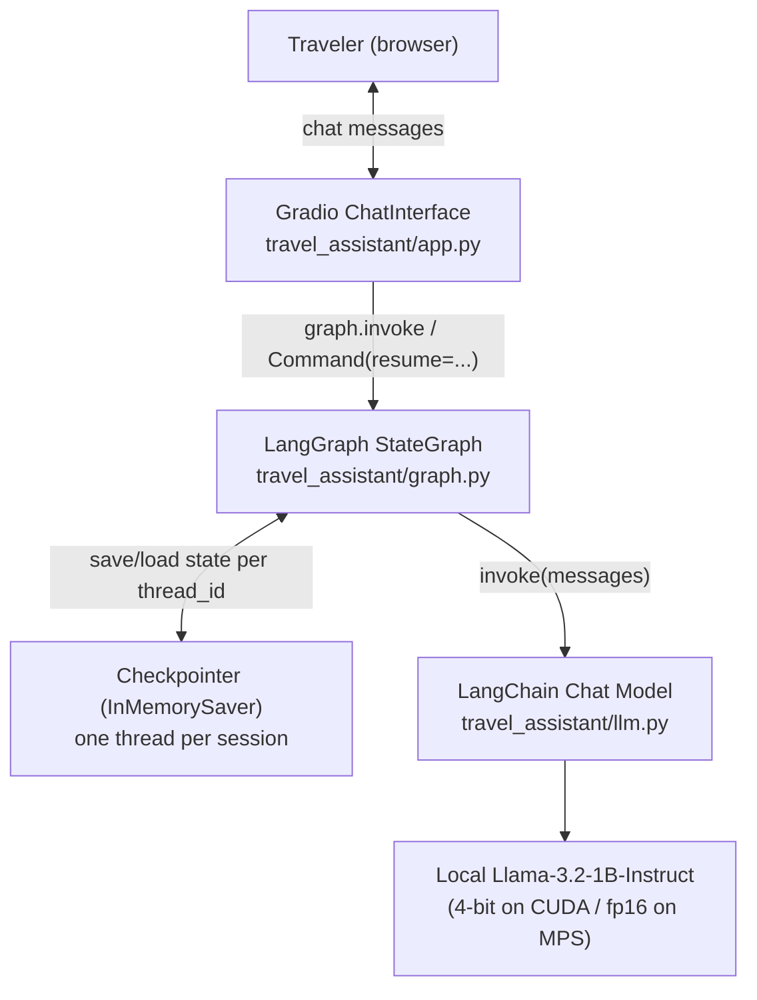
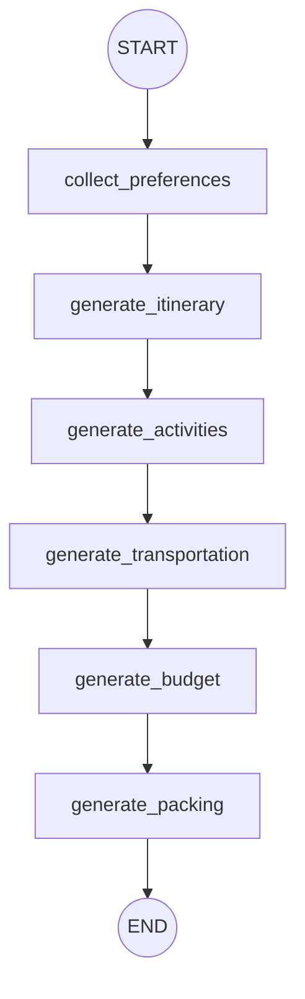
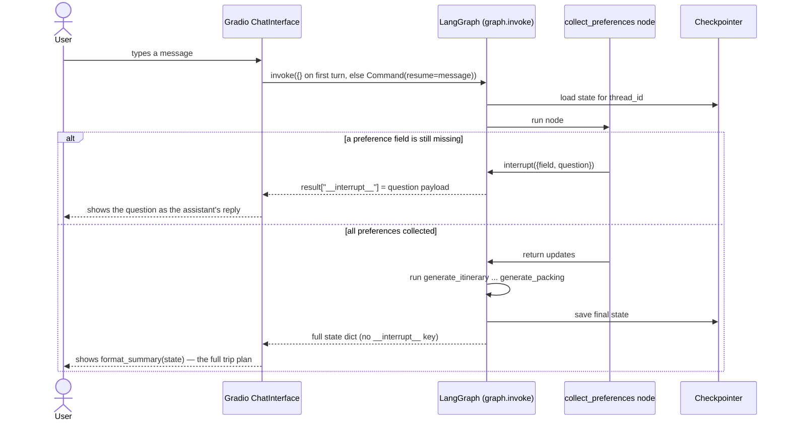

# Design Document: AI-Powered Travel Assistant Planner

Group 4 — MSAI-631-B01 (Week 2 deliverable)

## 1. Purpose

This document details the system architecture, conversational workflow, and
interaction design for the AI-Powered Travel Assistant Planner described in
the [Project Proposal](../Group%204_Project%20Proposal.pdf). It expands the
proposal's scope into a concrete design: how the chatbot is structured
internally (LangGraph), how a user's conversation actually flows turn by
turn, and how that maps to the in-scope features (destination selection,
preference collection, itinerary generation, activity recommendations,
transportation suggestions, budget estimate, packing checklist).

## 2. System Architecture



**Why LangGraph instead of calling `transformers` directly:** the proposal's
chatbot has a clear multi-stage scope (collect preferences → itinerary →
activities → transportation → budget → packing). LangGraph models this as an
explicit `StateGraph` where the *code* controls what happens next, and the
LLM is only ever asked to generate text for one stage at a time. This is
more reliable than an LLM-driven agent loop, which matters because the
project's chosen model (~1B parameters) is not strong enough to plan
multi-step tool use on its own.

**Session isolation:** each browser session gets a random `thread_id`
(`travel_assistant/app.py`). LangGraph's checkpointer keys all state by
`thread_id`, so multiple users can chat with the deployed demo at once
without seeing each other's trips.

## 3. Workflow Diagram (LangGraph state machine)

This is the actual graph compiled in `build_graph()` (`travel_assistant/graph.py`)
— six nodes, all fixed edges (no conditional/LLM-driven routing):



### 3.1 `collect_preferences` (human-in-the-loop)

This single node is where all the conversational back-and-forth happens.
Internally it asks up to five questions, one at a time, in a fixed order —
not separate graph nodes, but sequential `interrupt()` calls inside the one
node (LangGraph supports multiple interrupts per node; already-answered
fields are skipped on replay):


| Order | Field | Question asked |
|---|---|---|
| 1 | `destination` | Where would you like to travel to? |
| 2 | `trip_length_days` | How many days will your trip be? |
| 3 | `group_type` | Who's traveling — solo, a couple, family, friends, or students? |
| 4 | `interests` | What are you most interested in on this trip (e.g. food, history, nature, nightlife, relaxation)? |
| 5 | `budget_level` | What's your budget level — budget, moderate, or luxury? |

Each `interrupt()` call pauses the entire graph run and returns control to
the Gradio UI, which displays the question as the assistant's next chat
bubble. The graph resumes exactly where it paused once the user answers —
already-answered fields are skipped on replay, so a user who provides a
field early (or the app is extended to parse multiple fields from one
message later) is never asked twice.

### 3.2 Generation nodes

Once all five preferences are collected, five nodes run automatically in
sequence, each making exactly one LLM call:

| Node | Reads | Produces |
|---|---|---|
| `generate_itinerary` | destination, trip length, group, interests, budget | day-by-day itinerary |
| `generate_activities` | destination, interests, group | 5–8 bulleted attraction/activity picks |
| `generate_transportation` | destination, trip length, group, budget | getting-around guidance |
| `generate_budget` | trip length, group, budget level | a **deterministic** rate-table dollar estimate, narrated by the LLM |
| `generate_packing` | destination, trip length, group, interests | bulleted packing checklist |

The budget estimate is intentionally hybrid: the dollar figure comes from a
fixed rate table (`_DAILY_RATE_BY_BUDGET` × `_GROUP_MULTIPLIER` × days) in
plain Python, and the LLM only writes a short narrative around that number.
This keeps the one field users are most likely to sanity-check (a total
dollar amount) independent of the small model's arithmetic ability.

## 4. State Schema

`travel_assistant/state.py` defines the single `TravelState` shared across
every node:

```python
class TravelState(TypedDict, total=False):
    destination: Optional[str]
    trip_length_days: Optional[int]
    group_type: Optional[str]
    interests: Optional[str]
    budget_level: Optional[str]

    itinerary: Optional[str]
    activities: Optional[str]
    transportation: Optional[str]
    budget_estimate: Optional[str]
    packing_list: Optional[str]
```

A field being absent/`None` is how a node knows whether it still needs to
ask for it (preferences) or generate it (outputs). Nodes return partial
dicts; LangGraph merges each return value into the persisted state for that
`thread_id`.

## 5. Interaction Sequence (one full turn)



Key implementation detail (`travel_assistant/app.py`): `respond()` checks
for the `"__interrupt__"` key in the dict returned by `graph.invoke()`. If
present, its `.value["question"]` is shown to the user and the *next*
message they send is passed back in as `Command(resume=message)`. If
absent, the graph has run to completion and `format_summary()` renders all
five generated sections into one message.

## 6. UI Design

A single Gradio `ChatInterface` (`travel_assistant/app.py`) — no separate
screens or forms. This matches the proposal's "single chatbot" framing and
keeps the interaction entirely conversational.

```
┌─────────────────────────────────────────────────────┐
│  AI-Powered Travel Assistant Planner                 │
│  Say hi to get started...                            │
├─────────────────────────────────────────────────────┤
│  Assistant: Where would you like to travel to?        │
│  User: Kyoto, Japan                                    │
│  Assistant: How many days will your trip be?           │
│  User: 4 days                                          │
│  ...                                                   │
│  Assistant: ## Your trip to Kyoto, Japan               │
│             **Itinerary** ...                          │
│             **Activities** ...                         │
│             **Getting around** ...                     │
│             **Estimated budget** ...                   │
│             **Packing checklist** ...                  │
├─────────────────────────────────────────────────────┤
│  [ type a message...                    ] [ Send ]     │
└─────────────────────────────────────────────────────┘
```

### HCI heuristics considered

- **Visibility of system status** (Nielsen): the assistant always asks one
  explicit question at a time, so the user knows exactly what input is
  expected next, rather than facing an open-ended "tell me about your trip."
- **Match between system and the real world**: questions use plain
  conversational language ("Who's traveling?") instead of form-field labels.
- **User control and freedom**: because state is keyed by `thread_id`, a
  user can refresh and start a new session cleanly; a future iteration could
  add a visible "restart" action (see Section 8).
- **Error prevention over recovery**: `trip_length_days` is parsed
  defensively (`_parse_trip_length` regex-extracts the first number, e.g.
  from "about 5 days or so", defaulting to 3 if none is found) rather than
  rejecting free-form phrasing.
- **Consistency**: every generated section uses the same heading style so
  the final summary reads as one coherent document, not five disconnected
  LLM outputs.

## 7. Technology Stack

| Layer | Choice |
|---|---|
| Orchestration | LangGraph (`StateGraph`, `interrupt`/`Command`, checkpointer) |
| Model integration | LangChain (`HuggingFacePipeline`, `ChatHuggingFace`) |
| Model | `unsloth/Llama-3.2-1B-Instruct-bnb-4bit` (CUDA) or `unsloth/Llama-3.2-1B-Instruct` fp16 (Apple Silicon MPS / CPU) — auto-detected in `travel_assistant/llm.py` |
| UI | Gradio `ChatInterface` |
| Runtime environments | Google Colab (free T4 GPU) or a local machine with Apple Silicon / CUDA / CPU |
| Version control | GitHub |
| Testing | `pytest`, with a fake chat model stub so control-flow tests don't require a GPU |

## 8. Known Limitations / Out of Scope

Per the proposal: no flight/hotel booking, no payment processing, no visa
guidance, no live pricing or availability, not a replacement for a travel
agent. Additionally, as currently designed:

- Preference answers are taken at face value (beyond the trip-length regex
  parse); there's no re-prompt if a user gives a nonsensical answer (e.g. a
  budget level outside budget/moderate/luxury still gets accepted and
  defaults to the "moderate" rate in the budget calculation).
- There's no way to edit an earlier answer mid-conversation short of
  starting a new session.
- Model output quality varies with the local 1B model's limitations
  (weaker factual grounding than a larger model) — acceptable for this
  course project's scope but worth noting in the Results Report.
